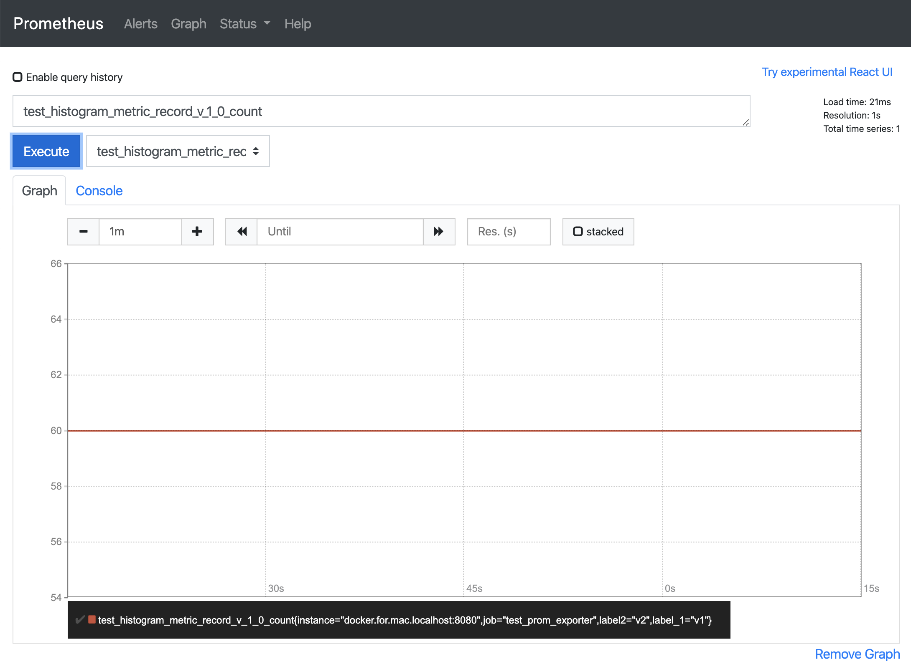
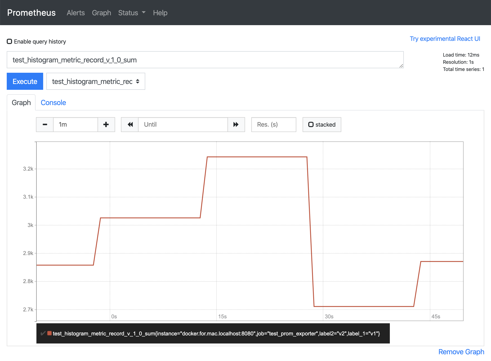
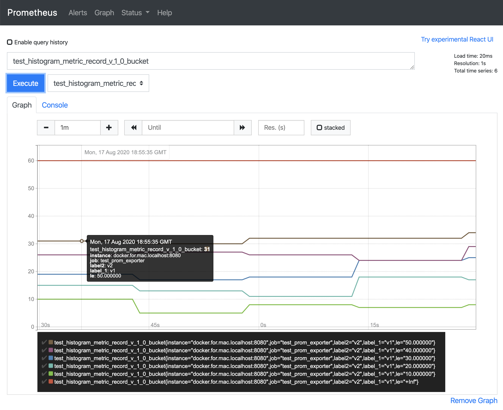

# Prometheus Exporter Example

In this example, the application in `main.cc` initializes the Prometheus exporter and exports 6 different OTel Aggregator to Prometheus. 
Here are more detailed explanations of it.

## Start Prometheus Instance
Start a Prometheus instance with Docker:
```shell script
docker run prom/prometheus
```
Add Prometheus Exporter job configuration to `~/docker/prometheus/prometheus.yml`
```yaml
scrape_configs:
  # ...
  # other jobs
  # ...
  - job_name: 'test_prom_exporter'
    static_configs:
      - targets: ['docker.for.mac.localhost:8080']
```
Restart Prometheus instance and specify configuration file
```shell script
docker run -d --expose 8080 \
  -p 9090:9090 \
  -v ~/docker/prometheus/prometheus.yml:/etc/prometheus/prometheus.yml  \
  prom/prometheus
```

## Run Example Program

To run the program, you must provide a command line argument to specify which Aggregator Kind you want to run the demo. The six choices are:
```
counter, gauge, mmsc, histogram, exact, sketch
```

Run with Bazel:
```shell script
bazel build //examples/prometheus_exporter:prometheus_exporter_example
bazel-bin/examples/prometheus_exporter/prometheus_exporter_example agg 
```
`agg` is the command line argument to specify.

For example, if we choose Histogram, this is what it would look like to build and execute the example:
```
$ bazel build //examples/prometheus_exporter:prometheus_exporter_example
$ bazel-bin/examples/prometheus_exporter/prometheus_exporter_example histogram 
Prometheus Exporter example program running on localhost:8080...
Running histogram example program...
```
The example program generates 4 metrics every second, and exports every 15 seconds.

Wait for a while, and visit `localhost:9090`. Choose the name of metrics to view the graphs.

Histogram Count: Each batch of metric data contains 60 metrics



Histogram Sum:



Histogram Buckets:



The process is similar for other OTel Aggregator.